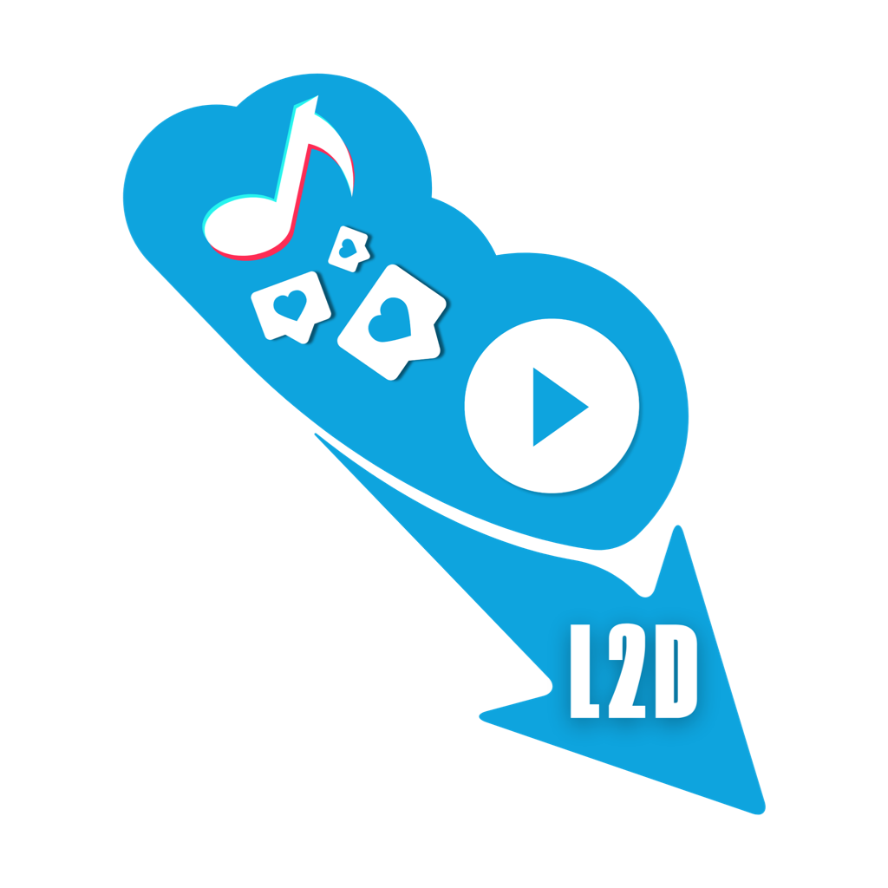
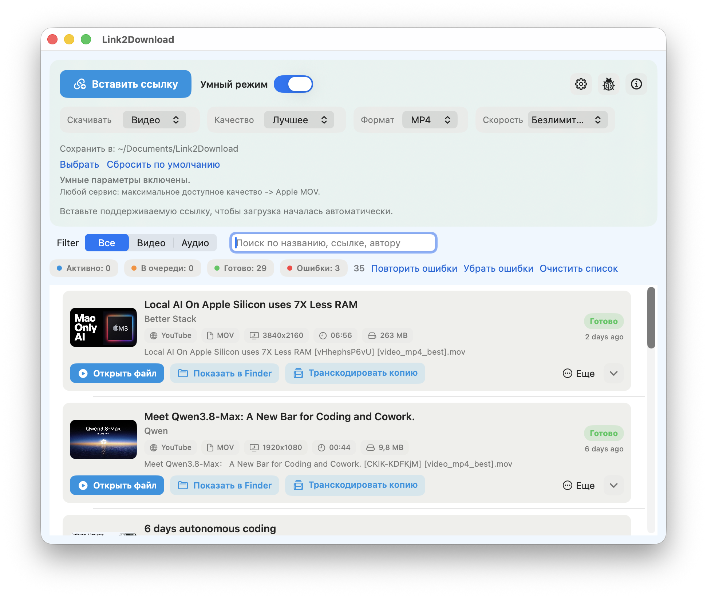
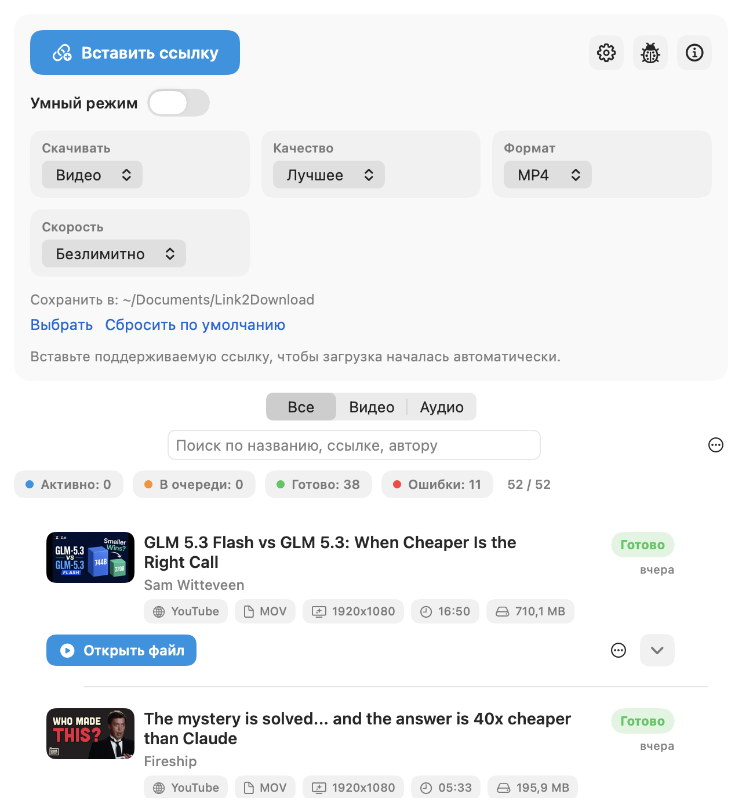
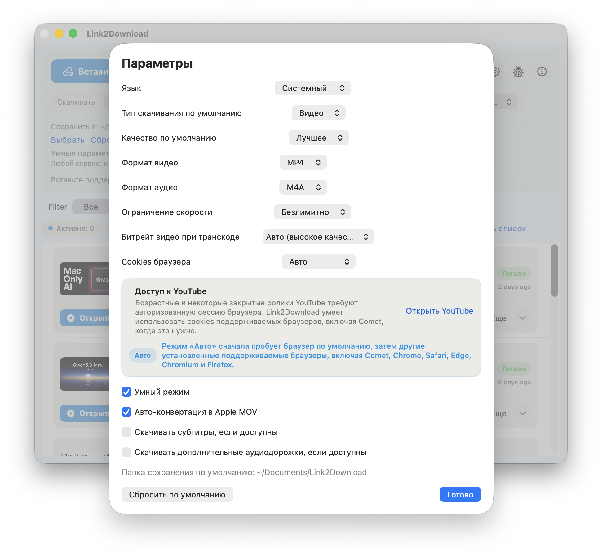

<p align="center">
  
</p>

<h1 align="center">Link2Download</h1>

<p align="center">A native desktop app for downloading video and audio with <code>yt-dlp</code>.</p>

<p align="center">
  
  
  <a href="https://github.com/globa-me/Link2Download/releases/latest"></a>
  <a href="https://github.com/globa-me/Link2Download/actions/workflows/ci.yml"></a>
</p>

<p align="center">
  <strong>Support independent GZ Apps development</strong><br>
  Get ready-to-run builds, updates, and member posts while helping me improve this project.
</p>

<p align="center">
  <a href="https://www.patreon.com/c/globa_me"></a>
  <a href="https://boosty.to/globa_me"></a>
</p>

## Platform status

| Platform | Status | Download |
| --- | --- | --- |
| macOS 12+ | Stable | [Latest DMG](https://github.com/globa-me/Link2Download/releases/latest/download/Link2Download-Installer.dmg) |
| Windows 11 | Preview source code | See [Windows setup](windows/README.md) |

The macOS app is ready for everyday use. The Windows WPF port is under active development and does not yet have a supported public installer.

## Highlights

- Download video or audio with quality, format, subtitle and speed controls.
- Keep searchable history and retry failed or cancelled downloads in place.
- Reveal completed files, reopen sources and manage downloads without leaving the app.
- Use browser cookies when a site requires an authenticated session.
- Run in English, Russian, Hindi or Chinese.

## Screenshots

<table>
  <tr>
    <td width="66%"><strong>Smart download and history</strong></td>
    <td width="34%"><strong>Compact manual mode</strong></td>
  </tr>
  <tr>
    <td></td>
    <td></td>
  </tr>
</table>

<details>
  <summary><strong>Settings</strong></summary>
  <br>
  
</details>

## Download for macOS

Current stable version: **1.4.1**.

- [Download Link2Download-Installer.dmg](https://github.com/globa-me/Link2Download/releases/latest/download/Link2Download-Installer.dmg)
- [Download the optional unblock helper](https://github.com/globa-me/Link2Download/releases/latest/download/Enable_Link2Download.command)
- [View release notes](CHANGELOG.md)

The app is ad-hoc signed but is **not notarized with an Apple Developer ID**. macOS may ask you to approve it once. This is expected for this release.

### Install and open the downloaded app

1. Open the downloaded `Link2Download-Installer.dmg`.
2. Drag `Link2Download.app` to the `Applications` shortcut in the installer window.
3. Eject the installer and open **Applications → Link2Download** once. If macOS blocks it, choose **Done** in the warning.
4. Open **System Settings → Privacy & Security**, scroll to the security message for Link2Download, and click **Open Anyway**.
5. Confirm with your Mac password or Touch ID, then click **Open**.

You only need to approve this copy of the app once. There is no need to lower the global “Allow applications from” security setting.

If **Open Anyway** is not shown, run `Enable_Link2Download.command` from the mounted installer (or the separate download) and enter your administrator password when requested. The helper copies the app to `/Applications` when needed, removes its quarantine attribute, adds a local Gatekeeper rule, and launches it. Use the helper only when it came from this repository’s [GitHub Releases](https://github.com/globa-me/Link2Download/releases).

Advanced fallback, when the app is already in `/Applications`:

```bash
sudo xattr -dr com.apple.quarantine /Applications/Link2Download.app
open /Applications/Link2Download.app
```

## Build it yourself on a Mac

Building from source avoids the downloaded-app approval prompt in the normal case. By default, the scripts build a Universal 2 app for both Apple Silicon and 64-bit Intel Macs.

### What you need

- macOS 12 or newer
- Internet access (to download `yt-dlp`, `ffmpeg`, and `ffprobe`)
- Xcode Command Line Tools
- about 1 GB of free space

### Steps for a first-time builder

1. Open **Terminal** (Applications → Utilities).
2. Install Apple’s command-line developer tools. A dialog may open; complete it, then return to Terminal:

   ```bash
   xcode-select --install
   ```

3. Download the source and enter its folder:

   ```bash
   git clone https://github.com/globa-me/Link2Download.git
   cd Link2Download
   ```

4. Download the runtime tools that will be included inside the app:

   ```bash
   ./scripts/fetch_runtime_tools.sh
   ```

5. Compile the app and start it:

   ```bash
   ./scripts/build_app.sh
   open build/Link2Download.app
   ```

   To verify the bundled YouTube runtime with a short partial download:

   ```bash
   ./scripts/test_youtube_runtime.sh
   ```

6. Optional: create the same DMG-style installer used for releases:

   ```bash
   ./scripts/build_dmg.sh
   open build/Link2Download-Installer.dmg
   ```

Build outputs are kept in `build/` and are not committed to Git. To rebuild after updating the source, run `git pull`, then repeat steps 4–6.

## macOS regression checks

```bash
./scripts/test_retry_history.sh
./scripts/test_runtime_process.sh
TEST_ARCH=x86_64 YTDLP_BIN="$PWD/build/macos-x86_64/Link2Download.app/Contents/Resources/bin/yt-dlp" ./scripts/test_youtube_runtime.sh
```

The network smoke test uses a clean environment and temporary home directory, without Homebrew, browser cookies or cached JavaScript. See [Intel fix handoff](docs/intel-runtime-fix.md) for findings and verification limits.

## Developer ID releases

The signed/notarized release workflow and credential setup are documented in [docs/macos-release.md](docs/macos-release.md). The public download instructions above still describe the existing unsigned-by-Developer-ID release; update them only after a notarized replacement is published.

Version 1.4.4 can be built as two separately signed applications for Apple Silicon and Intel:

```bash
SIGNING_IDENTITY='Developer ID Application: Gennadiy Zakharov (BN3D9H4C7J)' ./scripts/build_signed_macos_variants.sh
```

This creates architecture-specific apps and ZIP archives under `build/`. The apps inside the archives are Developer ID signed but must still be notarized before they are published as public downloads.

## Current macOS features

- Native SwiftUI interface (light + dark mode)
- One active download at a time, with history, search, retry and cancellation
- Video/audio formats, quality selection, subtitles, extra audio tracks and speed limits
- Open file, reveal in Finder, copy or open the source URL, and delete downloaded files
- Browser-cookie source selection for private/watch-later content
- English, Russian, Hindi and Chinese UI languages

## Runtime tools and advanced build details

The automatic runtime-tool download is the easiest option:

```bash
./scripts/fetch_runtime_tools.sh
```

- By default, it downloads both ARM64 and Intel static `ffmpeg`/`ffprobe` builds and combines them as Universal 2 binaries.
- The official macOS `yt-dlp` onedir distribution includes its complete `_internal` Python runtime; keep this directory next to `yt-dlp`.
- Deno is bundled and passed explicitly to yt-dlp for YouTube JavaScript challenges; no Homebrew installation is needed.
- All four runtime executables are checked for the target architectures.
- To make a smaller architecture-specific local build, run both scripts with the same override, for example `TARGET_ARCH=arm64` or `TARGET_ARCH=x86_64`.

If you already have compatible tools installed locally, embed them instead:

```bash
./scripts/prepare_embedded_tools.sh
```

Optional overrides:

```bash
YTDLP_BIN=/abs/path/yt-dlp FFMPEG_BIN=/abs/path/ffmpeg FFPROBE_BIN=/abs/path/ffprobe DENO_BIN=/abs/path/deno ./scripts/prepare_embedded_tools.sh
```

Build outputs:

- `build/Link2Download.app`
- `build/Link2Download-Installer.dmg`
- `build/macos-arm64/Link2Download.app`
- `build/macos-x86_64/Link2Download.app`
- `build/Link2Download-1.4.4-macOS-Apple-Silicon.zip`
- `build/Link2Download-1.4.4-macOS-Intel.zip`
- `build/Enable_Link2Download.command`

## Windows port

The native Windows implementation lives under `windows/` and uses `.NET 8` + `WPF`.

- Solution: `windows/Link2Download.Windows.sln`
- Main projects: `windows/src/Link2Download.Windows.App`, `windows/src/Link2Download.Windows.Core`, and `windows/src/Link2Download.Windows.Infrastructure`
- Windows setup and build instructions: [windows/README.md](windows/README.md)
- Porting plan: [docs/windows-port-plan.md](docs/windows-port-plan.md)

The current Windows code includes a strict single-download queue, persisted settings/history, runtime integration, diagnostics that redact URL secrets, and browser-cookie access disabled by default. The standalone Windows package remains a preview release until it is rebuilt with the current runtime tools on Windows.

## Privacy and responsible use

Link2Download runs locally. URLs, settings and download history are stored on the device; browser cookies are used only when the user enables a cookie source. Diagnostic logs redact URL query strings and fragments.

Site support follows the upstream [yt-dlp supported-sites list](https://github.com/yt-dlp/yt-dlp/blob/master/supportedsites.md) and can change as websites evolve. Download only content you are allowed to access and save.

## Contributing and support

- Read [CONTRIBUTING.md](CONTRIBUTING.md) before submitting a change.
- Open a [bug report](https://github.com/globa-me/Link2Download/issues/new) with the platform, app version and reproducible steps.
- Report security issues privately as described in [SECURITY.md](SECURITY.md).
- Browse the documentation index in [docs/README.md](docs/README.md).

## Project structure

- `Sources/` — macOS app source code
- `Resources/` — macOS icon, helper, and embedded runtime-tool directory
- `scripts/` — macOS build and packaging scripts
- `CHANGELOG.md` — release notes and version history
- `docs/windows-port-plan.md` — Windows migration plan and feature map
- `windows/` — Windows app source, runtime layout, and handoff documentation
- `build/` — generated local artifacts (ignored by Git)
